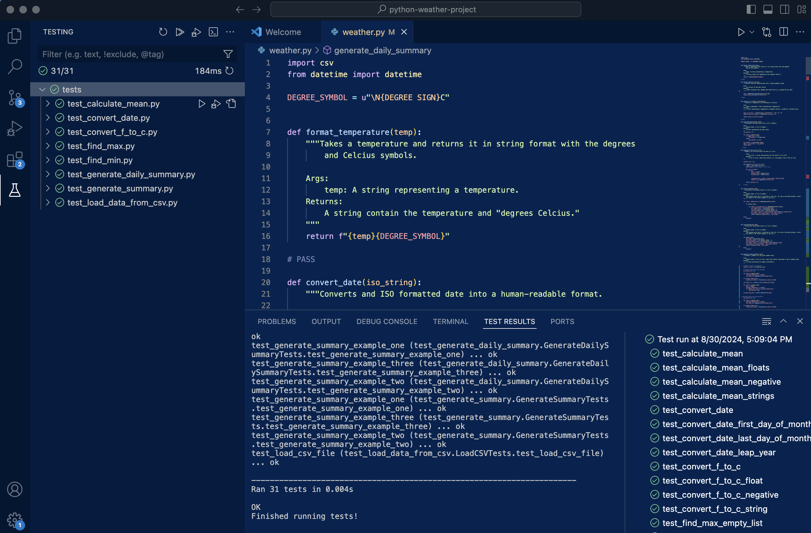

# Plus Resources: Weather Project Template

Starter code for the Plus Weather project.

## TODO

- [X] Implement the methods in `weather.py`.
- [X] Verify that everything works as intended by running the tests with `python run_tests.py`.

## Comments
Pleased to have managed to successfully implement methods to satisfy all tests. 
Have tried to be descriptive with object names. There is a bit of repetition throughout different functions. There's alot of mins, and maxs, so this could potentially be improved to increase readability.
I would like to explore further ways to do the find min/max. Seems like there should be a more efficient way.
Summaries also seem to have a lot of repetition and am keen to explore this to see if code can be consolidated/simplified.

